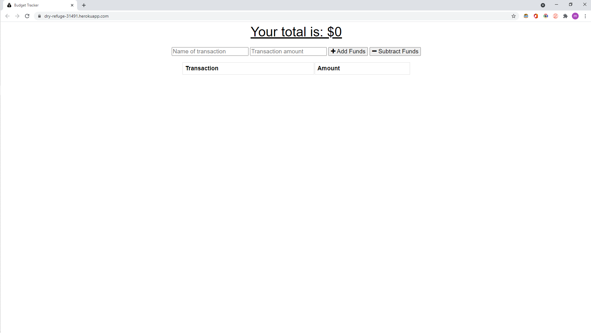

# E-commerce Back End module 13 assignment

This is a budget tracking application that can work offline

Thank you for stopping by!

## LINK TO deployed application
https://dry-refuge-31491.herokuapp.com/

## Resources used
1. Node.js
2. Visual Studio Code
3. Sequelize
4. Heroku

### Contact Info

Cell: 647-929-5340  
E-mail: matthewbianco@protonmail.com  
Linkedin: https://www.linkedin.com/in/matthew-bianco-a90193200/  